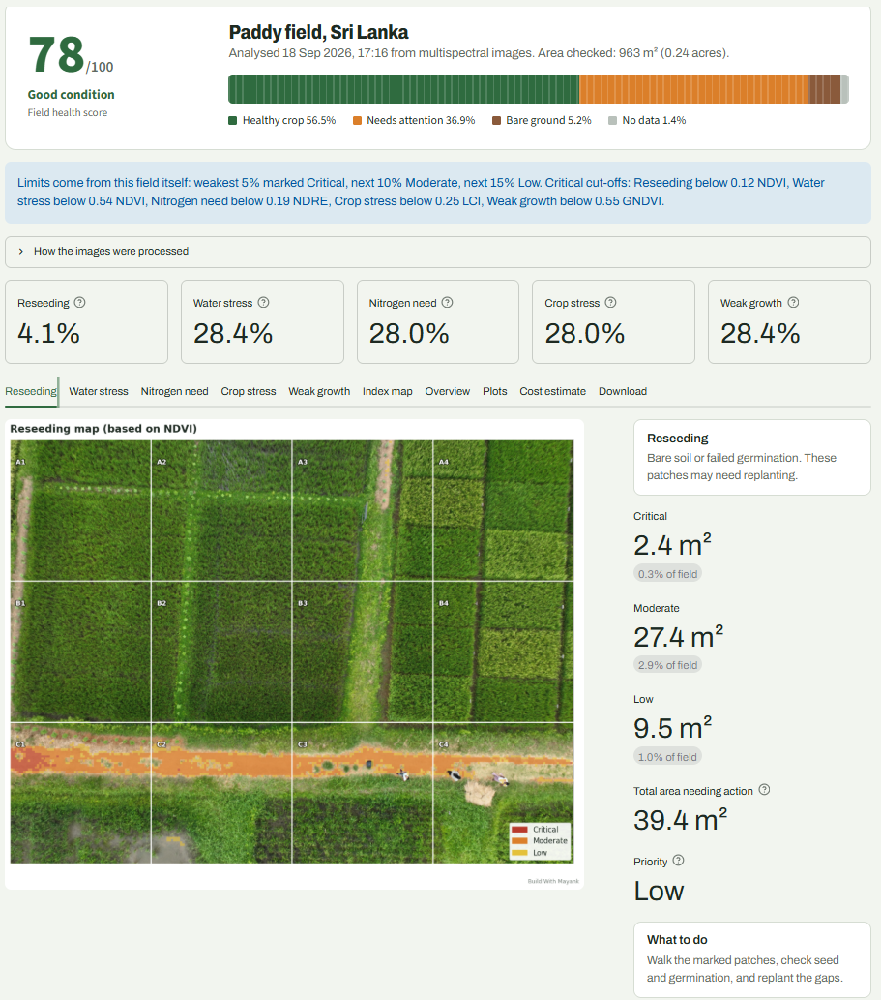
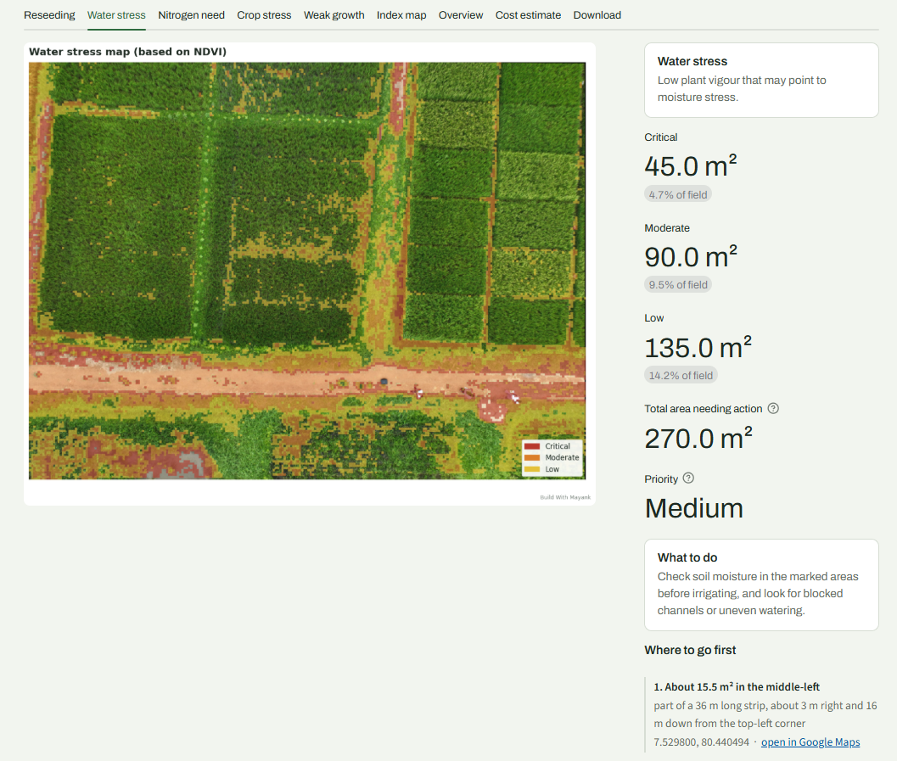
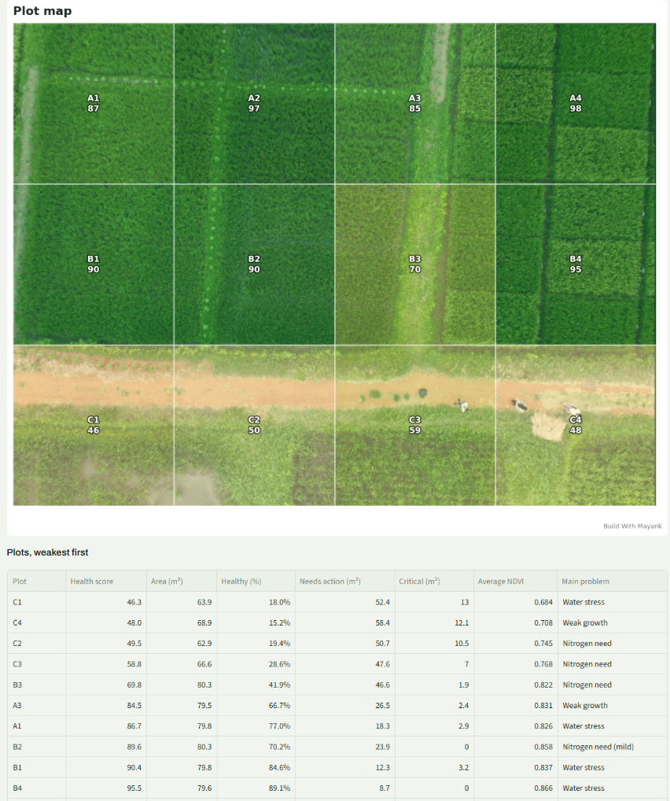
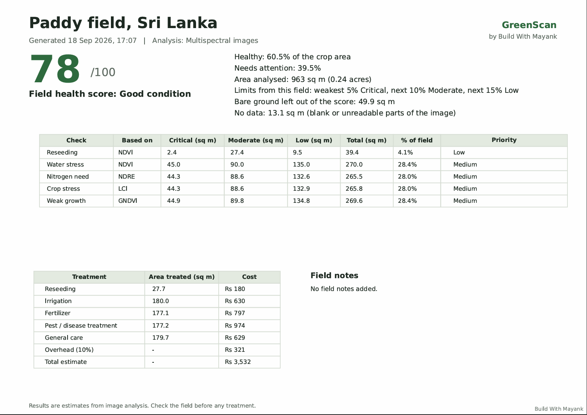

# GreenScan

Crop health analysis from drone multispectral images: health maps, a treatment plan, a cost estimate and GPS pins you can take to the field.

**Live demo:** _add your Streamlit link here_
Open the app and press **Load sample field** to see a full report in a few seconds.



---

## What it does

Upload a drone photo of a field, plus multispectral bands if the camera recorded them, and GreenScan returns:

- **A field health score** with the share of healthy crop, area needing attention and bare ground
- **Five checks**, each with its own map: reseeding, water stress, nitrogen need, crop stress and weak growth
- **Where to go first**: the largest critical patches with their area, GPS coordinates and a Google Maps link
- **Plot mode**: split the field into plots (A1, A2, B1...) and score each one separately
- **A cost estimate** in rupees, built from your own rates and the area that actually needs treatment
- **Downloads**: a branded PDF report, a CSV of the grid, a JSON summary and a KML file of map pins

Without multispectral bands the app still runs on a normal RGB photo, using VARI and GLI, and says clearly that the result is approximate.

| Multispectral mode | RGB-only mode |
| --- | --- |
| NDVI, NDRE, LCI, GNDVI | VARI, GLI |
| All five checks | Reseeding and weak growth only |
| Needs Red + NIR bands | Works with any drone photo |

---

## Screenshots

| Action map | Plot map | PDF report |
| --- | --- | --- |
|  |  |  |

---

## How it works

1. **Read the camera data.** Flight height, focal length, sensor size and GPS come from the EXIF and XMP metadata inside the images, so ground sampling distance and field area are worked out automatically instead of being guessed.
2. **Calibrate the bands.** DJI multispectral files hold raw sensor numbers. Black level, lens vignetting, sensor gain, exposure time and the sunlight sensor reading are applied to turn them into reflectance-like values.
3. **Line up the images.** Each band comes from its own lens, and the RGB camera has a wider field of view than the multispectral one. Bands are aligned to NIR with ECC on gradient images, the red band through feature matching, and the RGB photo is undistorted and warped into the band frame using the camera's homography plus SIFT refinement.
4. **Build the grid.** The field is averaged into a grid (256 x 192 by default). No-data areas are excluded, and bare ground is separated from crop so that roads and paths do not count as a nutrient problem.
5. **Flag problems.** Either fixed index limits, or limits taken from the field itself (weakest 5% / 10% / 15%), which suits crops and sensors whose typical values differ.
6. **Report.** Maps, per-plot tables, a cost estimate, GPS pins and exports.

---

## Why calibration and alignment matter

The first version of this app scored a healthy paddy field **11 out of 100**. Two bugs caused it:

- Raw DJI band values were used directly, so NDVI over healthy rice came out around **0.33** instead of **0.85**, and nearly every cell looked like a problem.
- The RGB photo and the multispectral bands were simply stretched to the same size, so the marks landed in the wrong places: crop was flagged while the road stayed clean.

After fixing both, the same images score **93 out of 100**, the flagged areas sit on the road and the wet patch, and the field area came down from a wrong 3,521 m² to the correct 963 m².

---

## Run it locally

```bash
git clone https://github.com/letsbuildwithmayank/greenscan.git
cd greenscan
python -m venv venv
venv\Scripts\activate        # Windows
# source venv/bin/activate   # macOS / Linux
pip install -r requirements.txt
streamlit run app.py
```

Then open http://localhost:8501 and press **Load sample field**, or upload your own images.

### Using your own images

| File | What it is |
| --- | --- |
| `rgb.JPG` | Normal colour photo of the field (required) |
| `red.TIF` | Red band |
| `green.TIF` | Green band |
| `nir.TIF` | Near-infrared band |
| `rededge.TIF` | Red-edge band |

Upload the originals straight from the drone. Resizing or sending them through a chat app strips the metadata that calibration, alignment and GPS depend on.

---

## Sample data

The sample field bundled in `sample_data/` comes from an open research dataset:

> Fonseka, Ishani; Hewagamage, K.P; Halloluwa, Thilina; Rathnayake, Upul; Bandara, R M U S (2024),
> *"Multispectral Images on Paddy - Sri Lanka"*, Mendeley Data, V1, doi: [10.17632/h8s5mn52j6.1](https://doi.org/10.17632/h8s5mn52j6.1)

Licensed under CC BY 4.0 and used here for demonstration only. The images were taken with a DJI Mavic 3M at 30 m, which makes them a fair test of the whole pipeline.

---

## Limitations

Worth knowing before trusting a report:

- **One photo covers a small area.** At 30 m a Mavic 3M multispectral frame covers about 0.24 acre; at 120 m, the legal ceiling in India, about 3.8 acre. Larger fields need a stitched map, which is planned next.
- **Index limits are general, not crop-specific.** For an unfamiliar crop, the "compare within this field" mode is the safer choice.
- **Coordinates are accurate to a few metres**, since they are worked out from the photo's GPS, heading and ground size.
- **Water stress and nitrogen need are indications, not diagnoses.** Confirm on the ground, or with a soil test, before applying anything.
- Tested with DJI Mavic 3M imagery. Other multispectral cameras will load, but without their calibration data the index values are less reliable.

---

## Built with

Python, Streamlit, OpenCV, NumPy, pandas, Matplotlib, tifffile, Pillow.

---

## Roadmap

- GeoTIFF support for stitched orthomosaics (DJI Terra, Pix4D, WebODM) and Sentinel-2 satellite tiles
- Comparing two flights to show what changed after a treatment
- Plot boundaries from an uploaded KML or GeoJSON file

---

## Author

**Mayank** — Build With Mayank
B.Tech (AI & ML) · websites, Android apps and AI-powered tools
letsbuildwithmayank@gmail.com

Open to freelance work. If you need something like this for your farm, college or agri business, get in touch.

---

## License

MIT — see [LICENSE](LICENSE). The sample data keeps its own CC BY 4.0 licence.
