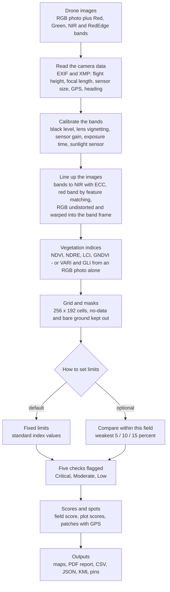
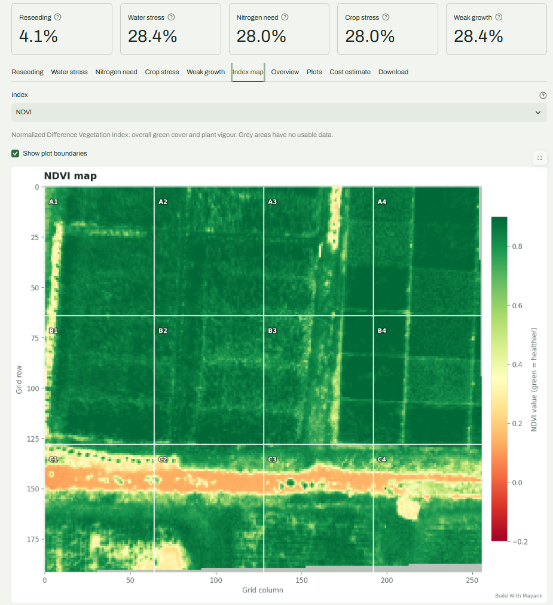
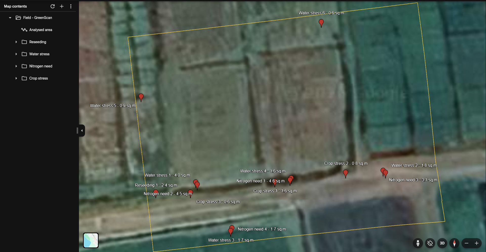

# GreenScan

**Crop health analysis from drone multispectral images.** Upload a flight, get a health score, maps of what needs attention, a plot-by-plot table, a cost estimate in rupees, and GPS pins you can open in Google Maps and walk to.

**Live demo:** _add your Streamlit link here_ — open it and press **Load sample field** for a full report in a few seconds.


*The report header. The big number is the field health score. The strip below splits the image into healthy crop, area needing attention, bare ground and no data. Under that, each of the five checks shows how much of the field it flagged, and the blue line states the exact cut-offs used — this run used the "compare within this field" mode.*

---

## What it does

- **A field health score** with the share of healthy crop, area needing attention and bare ground
- **Five checks**, each with its own map: reseeding, water stress, nitrogen need, crop stress and weak growth
- **Where to go first** — the biggest problem patches with their area, GPS coordinates and a Google Maps link
- **Plot mode** — split the field into plots (A1, A2, B1…) and score each one separately
- **A cost estimate** in rupees, built from your own rates and the area that actually needs treatment
- **Exports** — a branded PDF report, a CSV of the grid, a JSON summary and a KML file of map pins

Without multispectral bands the app still runs on a normal RGB photo, and says clearly that the result is approximate.

| | Multispectral mode | RGB-only mode |
| --- | --- | --- |
| **Needs** | Red + NIR bands | Any drone photo |
| **Indices** | NDVI, NDRE, LCI, GNDVI | VARI, GLI |
| **Checks** | All five | Reseeding and weak growth |

---

## How it works



The two steps that decide whether any of this is trustworthy are **calibration** and **alignment**. Here is why.

---

## Why calibration and alignment matter

The first version of this app scored a healthy paddy field **11 out of 100**. Two bugs caused it:

- **Raw sensor numbers were used as they were.** DJI multispectral files store raw values, and each band is shot at its own gain and exposure. NDVI over healthy rice came out around **0.33** instead of **0.85**, so nearly every cell looked sick.
- **The images did not line up.** The RGB camera sees a wider area than the multispectral one, and every band has its own lens. Stretching them to the same size put the marks in the wrong places: crop was flagged while the road stayed clean.

| | Before | After |
| --- | --- | --- |
| NDVI over healthy rice | 0.33 | 0.85 |
| Field health score | 11 / 100 | 93 / 100 |
| Area of the field | 3,521 m² (wrong) | 963 m² |
| Where the marks sat | shifted off the road | on the road and the wet patch |

---

## Screenshots

### Problem maps, with places to go


*Each check gets its own map. Red, orange and yellow mark Critical, Moderate and Low. The side panel gives the area at each level, a priority, what to do about it, and **Where to go first**: the biggest patches with their size, GPS coordinates and a Google Maps link. Patches close together are merged into one pin, and a long strip along a road or bund is split into pieces so the pins stay useful.*

### The index grid behind the maps



*The NDVI values the maps are built from, with plot boundaries drawn on top. Dark green is dense healthy paddy. The orange band across the middle is the dirt road: the app treats it as bare ground, keeps it out of the health score, and does not count it as a nutrient problem.*

### Plot by plot


*Plot mode divides the analysed area into plots named from the top-left and scores each one. The table ranks them weakest first, with area, healthy share, critical area, average NDVI and the main problem. Here the C row scores 46-59 because the road runs through it, while the paddy plots above sit between 85 and 98.*

### The PDF report


*Page one of the report: score, area analysed, what was left out, a table for every check and the cost estimate. Maps, plot tables and the index map follow on later pages, and everything carries the field name and your branding.*

### Pins in Google Earth



*The KML export opened in Google Earth: the outline of the analysed area plus a pin on every critical patch, grouped into folders by check. Hand this to whoever walks the field, or import it into Google My Maps to use it on a phone.*

---

## Two ways to decide what counts as a problem

| | Fixed limits | Compare within this field |
| --- | --- | --- |
| **How** | Standard index values for each check | The weakest 5 / 10 / 15 percent of this field |
| **Best for** | Common field crops with known behaviour | An unfamiliar crop or sensor, or ranking plots against each other |
| **On the sample field** | 93 / 100, with only a few percent flagged | 78 / 100 by design, since the weakest slices are always marked |

Reseeding always uses fixed limits, because bare soil is an absolute thing rather than a relative one. If a reading is nearly the same everywhere, nothing is marked for it and the report says so.

---

## Run it locally

```bash
git clone https://github.com/letsbuildwithmayank/greenscan.git
cd greenscan
python -m venv venv
venv\Scripts\activate        # Windows
# source venv/bin/activate   # macOS / Linux
pip install -r requirements.txt
streamlit run app.py
```

Open http://localhost:8501 and press **Load sample field**, or upload your own images.

### Using your own images

| File | What it is |
| --- | --- |
| `rgb.JPG` | Normal colour photo of the field (required) |
| `red.TIF` | Red band |
| `green.TIF` | Green band |
| `nir.TIF` | Near-infrared band |
| `rededge.TIF` | Red-edge band |

Use the originals straight from the drone. Resizing them, or sending them through a chat app, strips the metadata that calibration, alignment, area and GPS all depend on.

---

## Sample data

The field bundled in `sample_data/` comes from an open research dataset:

> Fonseka, Ishani; Hewagamage, K.P; Halloluwa, Thilina; Rathnayake, Upul; Bandara, R M U S (2024),
> *"Multispectral Images on Paddy - Sri Lanka"*, Mendeley Data, V1,
> doi: [10.17632/h8s5mn52j6.1](https://doi.org/10.17632/h8s5mn52j6.1)

Licensed under CC BY 4.0 and used here for demonstration only. The images come from a DJI Mavic 3M flown at 30 m, which makes them a fair test of the whole pipeline.

---

## Limitations

Worth knowing before trusting a report:

- **One photo covers a small area.** At 30 m a Mavic 3M multispectral frame covers about 0.24 acre; at 120 m, the legal ceiling in India, about 3.8 acre. Bigger fields need a stitched map, which is next on the roadmap.
- **Index limits are general, not tuned per crop.** For an unfamiliar crop, compare-within-field is the safer choice.
- **Coordinates are accurate to a few metres.** They come from the photo's GPS, heading and ground size, not from a survey.
- **Water stress and nitrogen need are indications, not diagnoses.** Confirm on the ground, or with a soil test, before applying anything.
- **Tested with DJI Mavic 3M imagery.** Other multispectral cameras load fine, but without their calibration data the index values are less reliable.

---

## Built with

Python, Streamlit, OpenCV, NumPy, pandas, Matplotlib, tifffile, Pillow.

---

## Roadmap

- GeoTIFF support for stitched orthomosaics (DJI Terra, Pix4D, WebODM) and Sentinel-2 satellite tiles
- Comparing two flights to show what changed after a treatment
- Plot boundaries from an uploaded KML or GeoJSON file

---

## Author

**Mayank** — Build With Mayank
B.Tech (AI & ML) · websites, Android apps and AI-powered tools
letsbuildwithmayank@gmail.com

Open to freelance work. If you need something like this for your farm, college or agri business, get in touch.

---

## License

MIT — see [LICENSE](LICENSE). The sample data keeps its own CC BY 4.0 licence.
